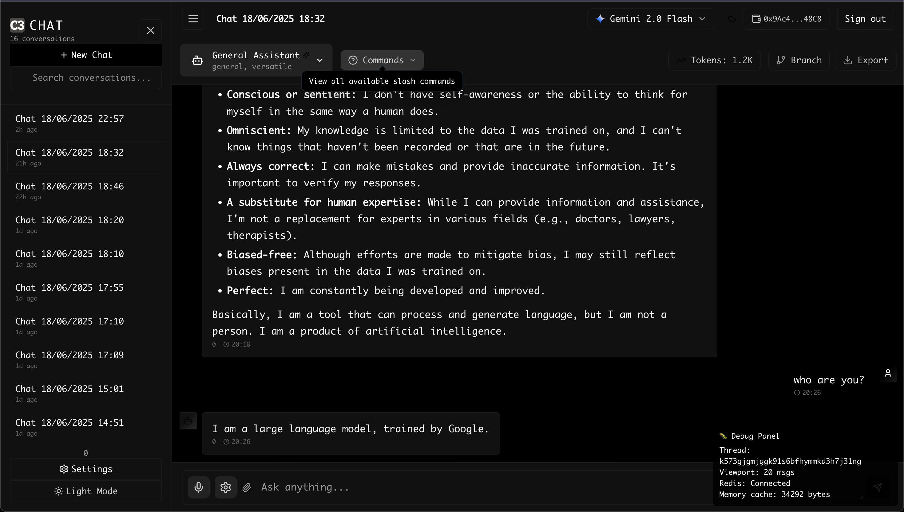

# C3Chat


*This is what it looks like with padding*

A multi-model AI chat interface built for the T3 Chat Cloneathon. Works with Gemini and OpenRouter models (tested with GPT-4o-mini, DeepSeek-R1, Llama-70B).

**Demo**: [clone3chat.vercel.app](https://clone3chat.vercel.app)  
**Note**: Don't use real passwords - auth security not fully verified.

First time deploying with Vite instead of my usual Next.js - the padding you see in the screenshot doesn't show up in production and I ran out of time to debug why. The CSS is there, it just... doesn't apply.

## What I Built

A chat app that syncs messages instantly across tabs using Convex. Each conversation gets a URL (`/chat/{id}`). API keys are encrypted client-side and never leave your browser. YOU CAN MAKE STABLECOIN PAYMENTS with USDC

### Tested Features
- Google Gemini (free tier)
- OpenRouter: GPT-4o-mini, DeepSeek-R1, Llama-70B
- Instant cross-tab sync
- Web search via `/search` command
- File uploads (images/PDFs)
- Offline message queueing

### Known Issues
- Gemini setup requires manual API key entry in settings
- Only tested two AI providers thoroughly

## Technical Choices

### Why Vite Instead of Next.js
I chose Vite, because I have Convex as the backend:
No need for Next.js API routes
No need for SSR/SSG - Convex handles real-time data
No need for middleware or server components
Authentication is handled by Convex Auth. 
This is a client-rendered SPA, no server-side logic. Vite gives me:
- 390ms cold starts vs 4.5s with CRA
- Instant hot module replacement
- No need for SSR/SSG - Convex handles real-time data

### Why Convex + Redis
**Convex** (`convex/` directory) handles:
- Real-time subscriptions without WebSocket setup
- Database with reactive queries
- User auth out of the box

**Redis** (`src/lib/redis-cache.ts`) is optional:
- Reduces Convex reads by ~80% when switching threads
- Viewport caching (50 messages at a time)
- Falls back gracefully if unavailable

### Key Implementation Details

**Message Sync** (`src/lib/scalable-sync-engine-v2.tsx`):
```typescript
// Smart sync detection - only sync significant changes
if (msg.isStreaming) {
  // For streaming, sync only if content differs by >100 chars
  if (!lastContent || Math.abs(msg.content.length - lastContent.length) > 100) {
    hasSignificantChanges = true;
  }
} else if (isStreamingRef.current.has(msgId)) {
  // Was streaming, now finished - always sync
  hasSignificantChanges = true;
  isStreamingRef.current.delete(msgId);
}

// Debounced sync - 300ms stable, 1000ms while streaming
const syncDelay = currentlyStreaming.size > 0 ? 1000 : 300;
```

**Redis Cache** (`src/lib/redis-cache.ts`):
```typescript
// Viewport loading with error handling
const rawMessages = await getRedis().zrange(key, -VIEWPORT_SIZE, -1);

messages = (rawMessages || []).map(item => {
  try {
    if (typeof item === 'string') {
      return JSON.parse(item);
    } else if (item && typeof item === 'object') {
      return item;
    }
    return null;
  } catch (error) {
    console.error('Failed to parse message:', item, error);
    return null;
  }
});
```

**Encryption** (`src/lib/crypto-utils.ts`):
- AES-GCM with persistent key (not fingerprint-based)
- Key stored in localStorage survives browser updates

**AI Integration** (`convex/ai.ts`):
- Each provider has its own adapter
- Streaming responses update every chunk
- Function calling for payments (experimental)

## Performance Reality

From local testing:
- Bundle size: 497KB gzipped
- Message display: <50ms from Convex
- Memory per thread: ~200KB (50 messages)
- Redis operations: 2 per message (was 7+)

## Security Warnings

1. **Passwords**: Auth implementation not security-audited. Use throwaway passwords.
2. **API Keys**: Encrypted locally but physical device access could expose them.
3. **Fixed**: Previous bug where API keys persisted between user accounts (see `SECURITY-FIX-API-KEY-ISOLATION.md`)

## Setup

```bash
git clone [repo]
cd c3chat
bun install
bunx convex dev
bun run dev
```

Optional Redis (`.env.local`):
```
VITE_KV_REST_API_URL=your-upstash-url
VITE_KV_REST_API_TOKEN=your-upstash-token
```

## What Didn't Work

1. **Message Deduplication**: Initially deduped after state updates, causing React key warnings. Fixed in `scalable-sync-engine-v2.tsx`.
2. **Browser Fingerprinting**: Keys got lost on browser updates. Switched to persistent random keys.
3. **Excessive Redis Sync**: Was syncing on every character. Now uses smart debouncing.

## Stack

- Frontend: React 19, TypeScript, Vite 6
- Backend: Convex (database + functions)
- Cache: Upstash Redis (optional)
- UI: Tailwind CSS v4
- Build: Bun

## Features

### Core
- **Multi-provider AI chat**: OpenAI, Gemini, Anthropic (via OpenRouter), DeepSeek
- **Real-time sync**: Messages appear instantly across tabs
- **Voice input/output**: 11+ languages with adjustable speech settings (`src/components/VoiceControls.tsx`)
- **File attachments**: Drag & drop images/PDFs with preview (`src/components/FileUpload.tsx`)
- **Web search**: `/search` command fetches real-time results
- **Code blocks**: Syntax highlighting with copy button

### UI/UX
- **Command palette**: Cmd/Ctrl+K for quick actions (`src/components/CommandPalette.tsx`)
- **Dark/light themes**: Persistent theme switching
- **Markdown support**: Tables, lists, code blocks
- **Thread management**: Create, delete conversations
- **Mobile responsive**: Works on all screen sizes

### Advanced
- **Token tracking**: See usage and costs per message (`src/components/TokenUsageBar.tsx`)
- **Encrypted API keys**: Client-side AES-GCM encryption
- **AI agents**: Specialized prompts (Research, Code Expert, Creative)
- **Collaboration presence**: See who's typing in real-time (`src/components/CollaborationPresence.tsx`)

### Web3 (Experimental)
- **Wallet integration**: MetaMask/WalletConnect (`src/components/WalletConnect.tsx`)
- **USDC payments**: `/pay` command on Base Sepolia testnet (Gemini models only)
- **Get test USDC**: [Base Sepolia Faucet](https://faucet.circle.com/)

## Work in Progress (WIP)

These features have partial implementations or UI without backend:

- **Thread branching**: UI exists (`/branch` command) but functionality incomplete
- **Export conversations**: Commands shown but export not implemented
- **Message editing**: Not implemented
- **Thread archiving**: Not implemented
- **Projects/Workspaces**: Backend exists (`convex/projects.ts`) but no UI
- **Security audit**: Not conducted - use throwaway passwords

---

Built in a week for the [T3 Chat Cloneathon](https://cloneathon.t3.chat/). Prize deadline: June 18, 2025.